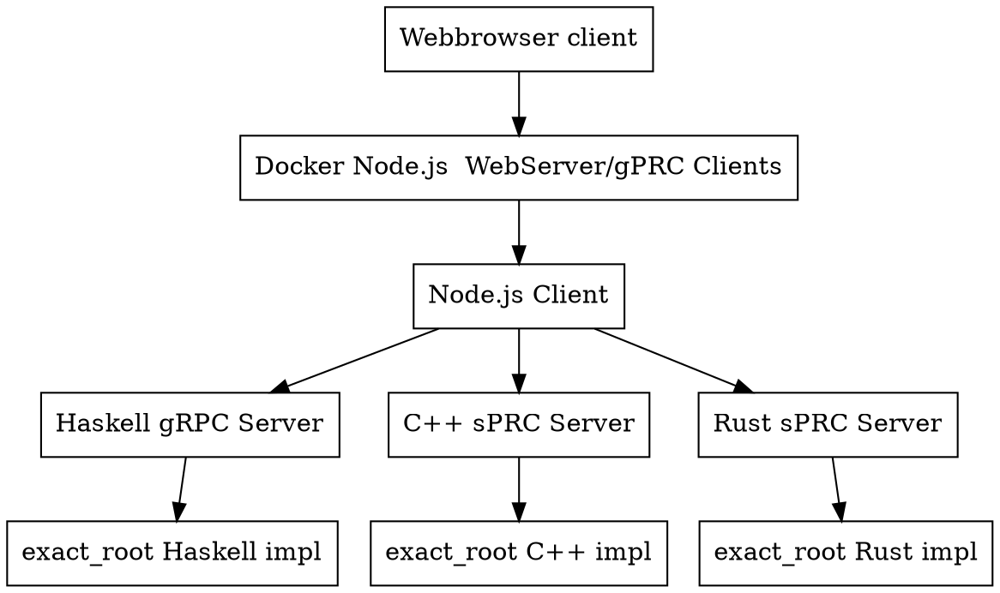

# cc_rust_haskell

## TODO
- [x] create uWebSocket in c++
- [x] create websocket_html_js_client
- [ ] create helo world shared object in c++, rust and haskell
- [ ] *.so aufgeben da im Haskell eine Haskell Environment in CMake integriert werden soll
- [ ] auf gRPC umstellen, Opensorce
- [ ] for c++, haskell, rust eigenen container erstellen
- [ ] composer, welcher alle container startet und die Projekte compeliert.
- [ ] eine Node.js server austellen, welcher die Anfragen an der Richtigen Container sendet.

## Architecture



## cc
- create project dir
- crate CMakeLists.txt
```
cmake_minimum_required(VERSION 3.15)

# Project name
project(hello_word)

# C++ standard
set(CMAKE_CXX_STANDARD 17)
set(CMAKE_CXX_STANDARD_REQUIRED ON)

# Add the executable
add_executable(hello_word
    src/main.cpp
)
```
- create main.cc in src
```
#include <iostream>

int main() {
    std::cout << "Hello World!" << std::endl;
    return 0;
}
```
- run cmake
```
cd build
cmake ..
cmake --build .
```

## rust
```
cargo new hello_world
cargo run
```

## haskell
```
stack setup
stack templates
stack new hello_world
``` 
- generate so
```
mkdir dist && stack ghc -- -dynamic -shared -fPIC -o dist/libexactroot.so -odir dist -hidir dist -stubdir dist/include src/ExactRootFFI.hs src/ExactRoot.hs
```

### uWebsockets
```
git clone https://github.com/flipkickmedia/uwebsockets-cmake.git

cmake -S . -B build -DCMAKE_BUILD_TYPE=Release
cmake --build build -j
```